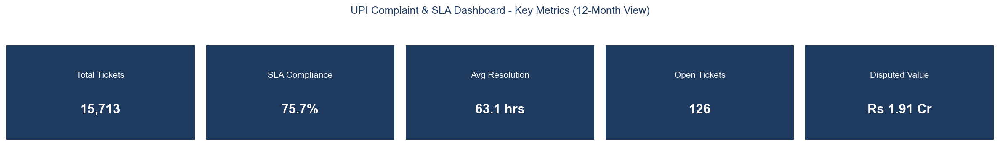
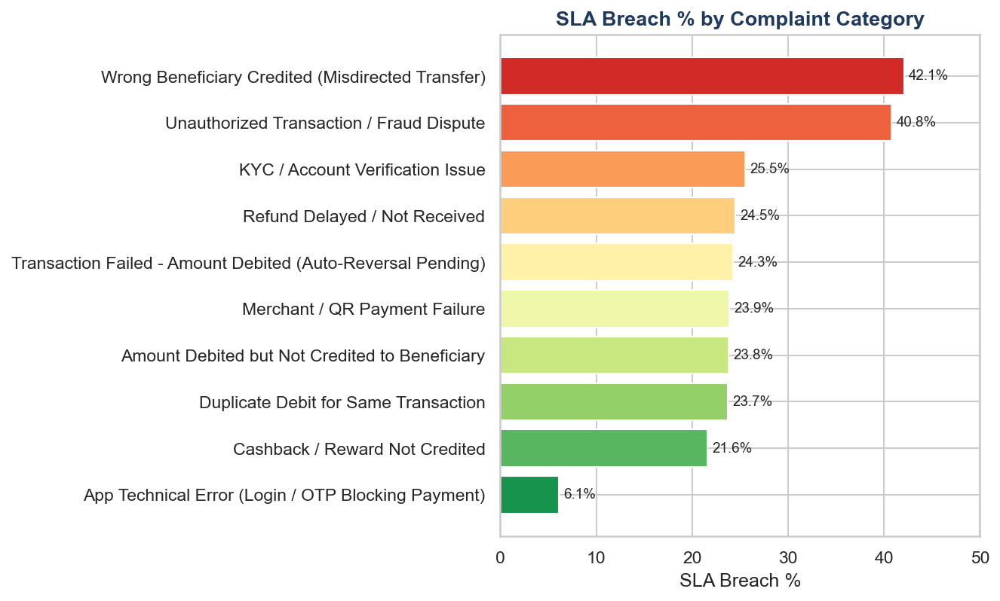
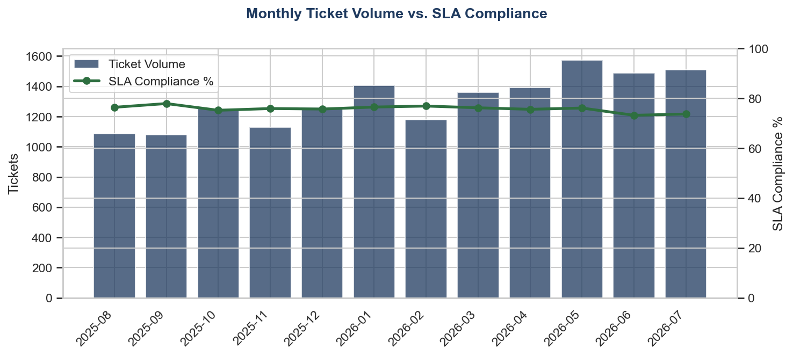
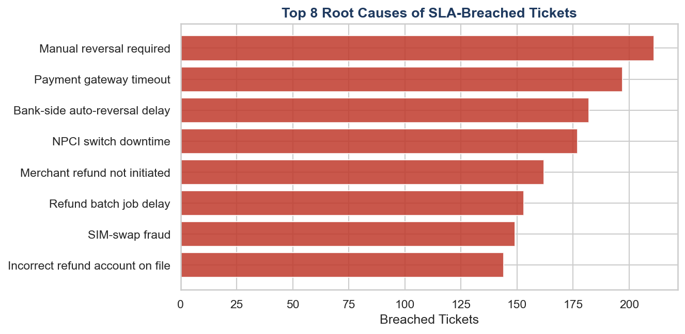
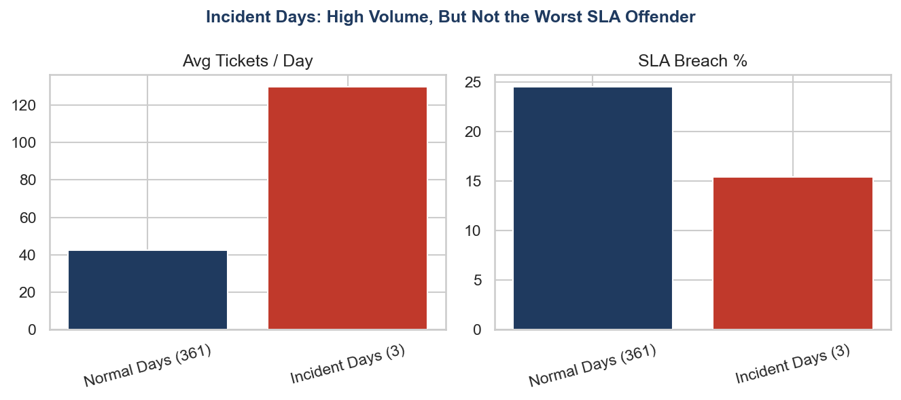

# UPI Digital Payments — Complaint & SLA Analytics Dashboard

**A Data Analyst portfolio project:** an end-to-end pipeline that turns 15,700+ raw digital-payments
support tickets into a clean SQL database, an interactive dashboard, and a data-backed root-cause
analysis — built to mirror the real complaint-and-SLA operations of a live UPI payments product.

> Built by Nikhil Sinha. Grounded in first-hand customer-support experience on the Google Pay
> account at Cognizant, and modeled on the complaint taxonomy published by the RBI Ombudsman Scheme
> for Digital Transactions, 2019. **All data in this project is synthetically generated — no real
> customer, transaction, or company data is used anywhere.**

---

## 1. The Business Problem

Every digital payments company (Google Pay, PhonePe, Paytm, and similar) receives thousands of
support complaints a day — failed transactions, delayed refunds, fraud disputes, misdirected
transfers. Support teams operate against **Service Level Agreements (SLAs)**: a promise like
*"we will resolve 90% of complaints within their target window."* When that promise is broken
repeatedly, customers churn and regulators take notice.

Operations leadership needs a fast answer to three questions:

1. **Which complaint categories breach SLA the most, and why?**
2. **Is the complaint queue getting better or worse over time?**
3. **What specific, actionable process fix would move the SLA compliance number?**

This project builds the full pipeline that answers those questions — from raw, messy ticket data
all the way to a written, numbers-backed recommendation.

---

## 2. Key Findings (see [`reports/root_cause_analysis.md`](reports/root_cause_analysis.md) for the full write-up)

| Metric | Value |
|---|---|
| Tickets analyzed | 15,713 |
| Overall SLA compliance | **75.7%** |
| Avg. resolution time | 63.1 hrs (median 40.4 hrs) |
| Disputed transaction value | ₹1.91 crore |

- **Root Cause #1:** The Fraud & Disputes team has the worst SLA breach rate of any team (**40.9%**) — driven mainly by *Wrong Beneficiary Credited* (42.1% breach) and *Unauthorized Transaction / Fraud Dispute* (40.8% breach).
- **Root Cause #2:** The *Failed Transaction* category group carries the **highest total disputed value at risk** (₹18.8 lakh), driven by 4 specific causes — manual reversal delays, payment gateway timeouts, bank-side reversal delays, and NPCI switch downtime — which together account for 767 breached tickets, more than the entire fraud queue.
- **Root Cause #3:** 235 tickets are never assigned an agent, and this "Unassigned" bucket breaches SLA at **29.8%** — worse than any actively staffed team.
- **Counter-intuitive finding:** simulated outage days cause a 3x ticket-volume spike, but SLA compliance during those days is actually *better* (84.6%) than on normal days (75.5%) — because visible incidents get immediate attention, while the chronic categories above quietly do more damage to the SLA number.

---

## 3. Dashboard Preview

*(These are real charts rendered directly from the project's own database — not mockups. The
project also ships a fully interactive Streamlit app and a clickable Excel workbook; static
previews are included here since this build environment has no display to screenshot live apps.)*

**Key metrics**


**SLA breach rate by category**


**Monthly volume vs. SLA compliance trend**


**Top root causes of SLA-breached tickets**


**Incident days: high volume, but not the worst SLA offender**


---

## 4. Architecture

```
generate_data.py  →  fact_complaints_raw.csv   (deliberately messy: mixed timestamp
                                                  formats, duplicates, missing agent IDs)
        │
        ▼
clean_transform.py →  fact_complaints_clean.csv (ISO-8601 timestamps, deduplicated,
                                                  validated, recomputed SLA flags)
        │
        ▼
build_database.py  →  database/complaints.db    (normalized SQLite: 1 fact table +
                                                  3 dimension tables, indexed)
        │
        ├──→ sql/analysis_queries.sql   (18 analytical queries)
        ├──→ dashboard/build_excel_dashboard.py → reports/UPI_Complaint_SLA_Dashboard.xlsx
        └──→ dashboard/streamlit_app.py → interactive filterable web dashboard
```

One command (`scripts/run_pipeline.py`) rebuilds everything from a single source of truth —
nothing is ever manually re-entered across the CSV, database, and dashboard layers.

---

## 5. Repository Structure

```
01-UPI-Payments-Complaint-SLA-Dashboard/
├── README.md
├── requirements.txt
├── data/                          # generated CSVs (raw + clean + dimensions)
├── scripts/
│   ├── generate_data.py           # synthetic data generator
│   ├── clean_transform.py         # ISO-8601 cleaning, dedup, validation
│   ├── build_database.py          # loads clean data into SQLite
│   ├── run_queries_check.py       # validates every query in analysis_queries.sql
│   ├── generate_preview_images.py # renders the static chart previews above
│   └── run_pipeline.py            # one-command end-to-end orchestrator
├── sql/
│   ├── schema.sql                 # normalized star-schema table definitions
│   └── analysis_queries.sql       # 18 analytical queries (KPIs, SLA, trends, agents)
├── database/
│   └── complaints.db              # built SQLite database
├── dashboard/
│   ├── build_excel_dashboard.py   # generates the Excel workbook
│   └── streamlit_app.py           # interactive web dashboard
├── reports/
│   ├── root_cause_analysis.md     # written findings & recommendations
│   └── UPI_Complaint_SLA_Dashboard.xlsx
└── screenshots/                   # static chart previews (see above)
```

---

## 6. How to Run This Yourself

```bash
# 1. Install dependencies
pip install -r requirements.txt

# 2. Run the full pipeline (generates data → cleans it → builds the database → builds Excel)
python scripts/run_pipeline.py

# 3. Launch the interactive dashboard
streamlit run dashboard/streamlit_app.py
```

Open `reports/UPI_Complaint_SLA_Dashboard.xlsx` directly in Excel for the offline version — no
BI tool required. Open `database/complaints.db` in any SQLite client (e.g., DB Browser for SQLite)
and run the queries in `sql/analysis_queries.sql` directly.

---

## 7. Tech Stack

| Layer | Tools |
|---|---|
| Data generation & cleaning | Python, Pandas, NumPy |
| Database | SQLite (normalized star schema, indexed) |
| Analysis | SQL (18 queries: KPIs, SLA breach analysis, trends, channel/agent performance) |
| Dashboards | Streamlit + Plotly (interactive), Excel/openpyxl (offline, with native charts) |
| Static visuals | Matplotlib, Seaborn |

---

## 8. Data Methodology & Honesty Note

Real complaint-level data is never published by payments companies for privacy reasons, so this
project uses a **realistic synthetic dataset**, generated by `scripts/generate_data.py` with a
fixed random seed for full reproducibility. The generator deliberately encodes real-world patterns
observed in actual fintech support operations and published regulatory guidance:

- A 10-category complaint taxonomy aligned to RBI's digital-payment Ombudsman Scheme categories.
- Illustrative SLA/TAT windows loosely modeled on RBI's 2019 circular on failed-transaction
  turnaround times (not an exact reproduction of any bank's real internal SLA table).
- Realistic volume seasonality: salary-date spikes, weekday/weekend patterns, ~50% YoY organic
  growth, and 3 simulated "incident days" that spike Technical/Failed-Transaction volume.
- Deliberately injected messiness in the raw export (4 mixed timestamp formats, duplicate rows,
  ~1.5% missing agent assignments) so the cleaning step has a genuine problem to solve — the same
  ISO-8601 timestamp-standardization skill used on this author's Uber Supply-Demand Gap Analysis
  project, applied here to a second, independent messy dataset.

**What I'd do differently in a real production setting:** connect directly to a live ticketing
system's API (e.g., Zendesk/Freshdesk) instead of a static CSV export, add PII masking/tokenization
for customer identifiers before the data ever reaches an analytics layer, and schedule the pipeline
to run on a recurring basis (e.g., via Airflow) rather than on-demand.

---

## 9. Skills Demonstrated

Data Analysis · Data Cleaning & Validation · SQL (star-schema design, aggregation, window-style
grouping) · Root-Cause Analysis · KPI Reporting · Dashboard Design (Streamlit, Excel) · Python
(Pandas, NumPy, Matplotlib, Seaborn, Plotly) · Stakeholder-Ready Reporting · Fintech Domain
Knowledge
